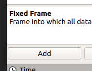
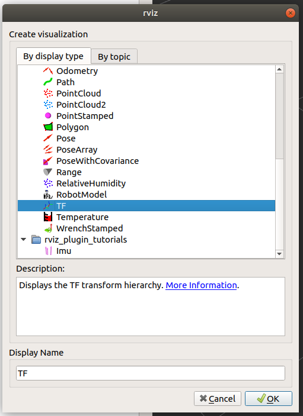
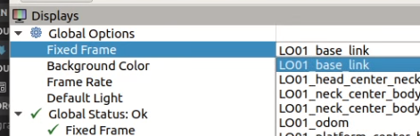
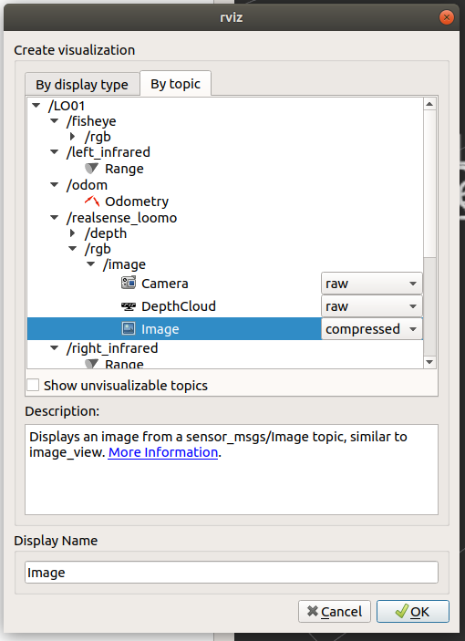
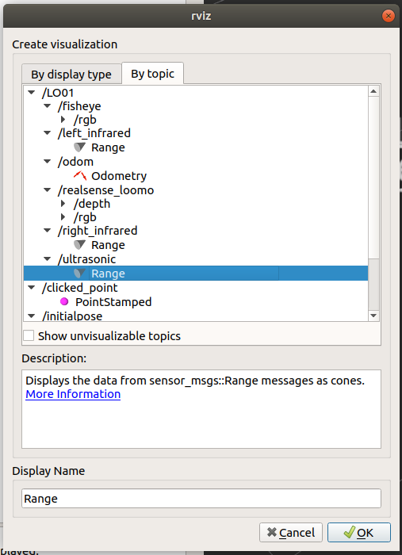
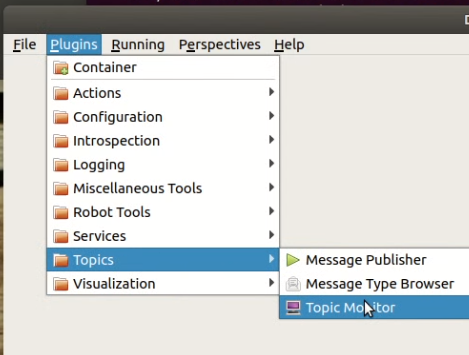
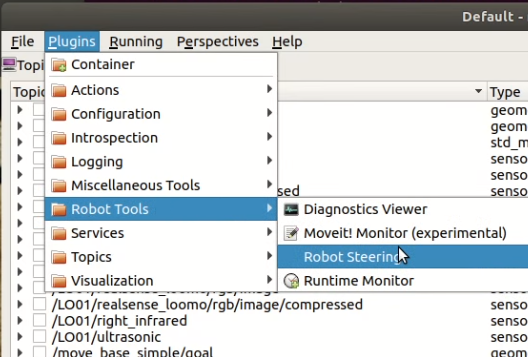
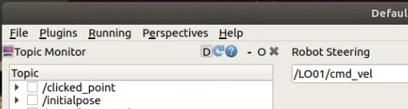

# Using android_loomo_ros_core

This document describes the process of setting up a Loomo and ROS PC so that both can communicate with each other.

You can use this node in either a USB tethered or Wifi tethered mode, depending on your use case. The USB tethered option requires some extra settings on the ROS master to ensure the Loomo can subscribe to topics.

## Prerequisites

1. A working installation of ROS Melodic. This code has only been tested against ROS Melodic running on Ubuntu 18.04, but it would conceivably work with ROS Kinectic, and ROS installations running on Windows 10. Instruction borrowed from [ROS Wiki](http://wiki.ros.org/ROS/Installation)

    - Update package registry
        ```
        $ sudo sh -c 'echo "deb http://packages.ros.org/ros/ubuntu $(lsb_release -sc) main" > /etc/apt/sources.list.d/ros-latest.list'
        ```

    - Add new apt key
        ```
        $ sudo apt-key adv --keyserver 'hkp://keyserver.ubuntu.com:80' --recv-key C1CF6E31E6BADE8868B172B4F42ED6FBAB17C654
        ```
    - Update the DEbian packages index:
        ```
        $ sudo apt update
        ```
    - Install ROS Desktop
        ```
        $ sudo apt install ros-melodic-desktop-full
        ```
    - Initialize rosdep
        ```
        $ sudo rosdep init
        $ rosdep update
        ```
    - Get your IP address
        ```
        $ ip addr show
        ```
    - Update  .bashrc
        ```
        $ nano ~/.bashrc
        ```
        Add the following to the end of the file ans save

        ```
        source /opt/ros/melodic/setup.bash
        export ROS_MASTER_URI=http://192.168.42.100:11311/
        export ROS_IP=192.168.42.100
        ```
    - Re-Init Shell
        ```
        $ source ~/.bashrc
        ```
    - Install Teleops
        ```
        $ sudo apt-get install ros-melodic-teleop-twist-keyboard
        $ roscd teleop_twist_keyboard/
        $ cd ../../lib/teleop_twist_keyboard
        $ sudo nano teleop_twist_keyboard.py
        ```

    - Update Teleop topic

        change the following line from
        ```python
            pub = rospy.Publisher('cmd_vel', Twist, queue_size = 1)
        ```
        to
        ```python
            pub = rospy.Publisher('LO01/cmd_vel', Twist, queue_size = 1)
        ```

2. A working NTP server running on the same machine as the ROS master. This is important: ROS is very particular about timestamps, and this apk will actively try to connect to an NTP server running on the ROS master. You will need to configure the NTP server to allow queries from the network that the Loomo is on.

    - Install ntp server
        ```
        $ sudo apt install ntp
        ```
    - Get your IP address
        ```
        $ ip addr show
        ```
    - Edit /etc/ntp.conf
        ```
        $ sudo nano /etc/ntp.conf
        ```
    - Add a line like the following using your own IP address as a reference
        ```
        restrict 192.168.42.0 mask 255.255.255.0 nomodify notrap nopeer
        ```
    - Restart NTP
        ```
        $ sudo service ntp restart
        ```

3. Switch Loomo into Developer Mode (Settings > System > Loomo Developer > Developer Mode)
    - (I think this requires an internet connection, so join a wifi network now.)

4. You might need to switch Android into Developer Mode (tap some setting 7 times...look online for instructions).

## Install

1. Modify the ip address on the following line in MainActivity.java
    ```java
        public MainActivity() { super("LoomoROS", "LoomoROS", URI.create("http://192.168.42.102:11311/")); }
    ```

2. Install the apk on Loomo, either by deploying it via Android Studio or using `adb install`

3. If that worked, there should be an app in Loomo's app drawer called `Loomo ROS`.

## Networking

### Wifi

1. The Loomo and the ROS master must be on the same Wifi network. It's best to use an IP address for the ROS master since name resolution on the Loomo has been a bit spotty.

### USB

1. Connect USB cable from Loomo's USB-C port to PC's USB-A port.

1. On Loomo, turn on USB Tethering (Settings > Wireless & Networks > More... > Tethering & portable hotspot > USB tethering)
On Ubuntu, you should see a popup from NetworkManager saying there's a new Wired Connection. You can rename it to Loomo if you want.

    At this point, the two devices are on a common network, and you should be able to ping one another.

1. You will almost certainly have to turn off the Loomo Wifi to make USB tethering work.

1. Enable USB tethering through the Android settings menu. You will have to re-enable tethering each time the USB cable is unplugged, or each time the Loomo boots.

1. Getting USB networking working will likely require you set the ROS_IP environment variable on the PC hosting the ROS master. Not having this variable set prevented the Loomo from subscribing to topics: it could publish, but wouldn't subscribe correctly.

## Launch

1. Open a terminal window and start ROS Core
    ```
    $ roscore
    ```
2. Tap the `Loomo ROS` app icon to launch the app. It should automatically connect and begin publishing data.

3. You can enable and disable certain subsystems by changing the toggle buttons on the homescreen.

4. Open another terminal window (<kbd>ctrl</kbd>-<kbd>shft</kbd>-<kbd>T</kbd>) and start RViz
    ```
    $ rviz
    ```
    - Click Add

        

    - Select TF and click OK

        

    - Change Global Options | Fixed Frame to ```LO01_base_link```

        

    - Click Add

        

    - Click By topic, select /LO01/realsense_loomo/rgb/Image and choose compressed and press OK

        

    - Click Add

        

    - Click By topic, select /LO01/ultrasonic/Range and press OK

        
        
5. Open another terminal window (<kbd>ctrl</kbd>-<kbd>shft</kbd>-<kbd>T</kbd>) and start RViz
    ```
    $ rqt
    ```
    - Select Plugins | Topics | Topic Monitor

        

    - Select Plugins | Robot Tools | Robot Steering

        

    - Change Robot Steering topic to ```/LO01/cmd_vel```

        

6. Open one more terminal window (<kbd>ctrl</kbd>-<kbd>shft</kbd>-<kbd>T</kbd>) and start teleop

    ```
    $ rosrun teleop_twist_keyboard teleop_twist_keyboard.py
    ```